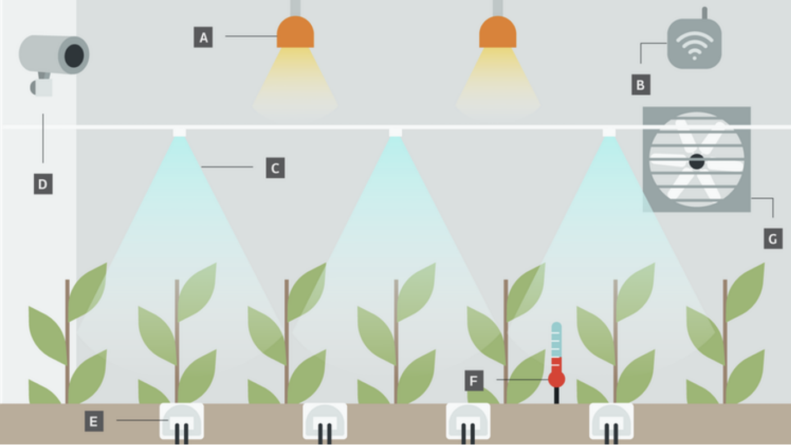

<h1 align="center"> Automated-Greenhouse-Assistant
</h1>
<h6>C++ Automation Project</h6>

The goal of this project is to simulate code that would function within a designed climate-control system for a greenhouse. These greenhouses create optimum growing conditions for plants based on automatic conditioning in results to certain stimuli such as motion, temperature, light, water, etc.

<h4>How It's Made:</h4>

Tech Used: C++, Arduino Uno Board

